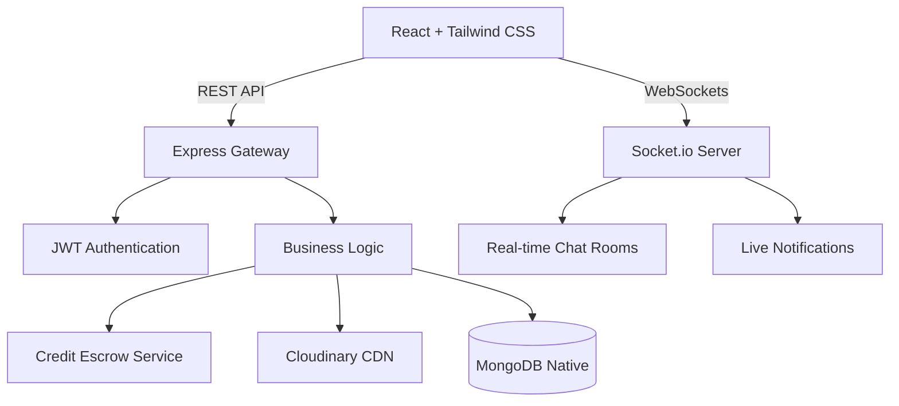

<div align="center">
  
  <h1>SkillSwap Campus</h1>
  <p>A Peer-to-Peer AI-Assisted Tutoring Marketplace for University Students</p>

  <div>
    
    
    
    
    
  </div>
</div>

---

## 📖 Overview

SkillSwap Campus is a fully-featured, peer-to-peer learning marketplace designed specifically for university students. It empowers students to exchange knowledge by teaching what they know and learning what they need. Instead of relying on expensive external tutors, SkillSwap utilizes a closed **Credit Escrow Economy**—users earn credits by mentoring others and spend credits to book sessions.

This project was built to solve the "cold start" problem in campus learning by providing structured scheduling, real-time communication, dispute resolution, and community discussion boards.

## ✨ Key Features

### 🎓 For Learners
- **Mentor Discovery Hub**: Advanced filtering and sorting (by rating, reputation, and skill) to find the perfect peer mentor.
- **Calendly-style Booking**: Seamlessly view mentor availability and book time slots with timezone awareness.
- **Real-Time Session Chat**: Private socket-based chat rooms that unlock file sharing (PDFs, PPTs) once a session is scheduled.
- **Community Doubts Forum**: Post anonymous questions with markdown and image support.

### 👨‍🏫 For Mentors
- **Availability Management**: Set weekly recurring schedules and manage custom durations.
- **Credit Economy Wallet**: Earn credits securely through a 2-step escrow system (Credits are held during the session and released upon completion).
- **Reputation & Ranking**: A composite algorithm `(Rating*10 + Rep*5 + Sessions*2)` dynamically ranks top mentors.
- **Session Notes**: Provide post-session summaries and resources directly in the chat interface.

## 🏗️ Architecture

SkillSwap uses a modern MERN stack architecture with real-time event-driven components.



### Tech Stack
- **Frontend**: React 19, TailwindCSS, React Router, Socket.io-client
- **Backend**: Node.js, Express.js 5, Socket.io
- **Database**: MongoDB (Mongoose)
- **Infrastructure**: Cloudinary (Image/File Storage), Node-Cron (Background Jobs)
- **Authentication**: JWT, bcryptjs

## 📸 Screenshots

*(Replace these placeholder links with actual screenshots of your deployed application)*

| Mentor Marketplace | Session Chat & File Sharing |
| :---: | :---: |
|  |  |
| **Availability Calendar** | **Credit Escrow Dashboard** |
|  |  |

## 🚀 Getting Started

### Prerequisites
- Node.js (v18 or higher)
- MongoDB running locally or a MongoDB Atlas URI
- Cloudinary Account (for file uploads)

### 1. Clone the repository
```bash
git clone https://github.com/yourusername/skillswap-campus.git
cd skillswap-campus
```

### 2. Environment Variables
Create a `.env` file in the `server` directory:
```env
PORT=5000
MONGODB_URI=mongodb://localhost:27017/skillswap
JWT_SECRET=your_super_secret_jwt_key
CLIENT_URL=http://localhost:5173

# Cloudinary Setup
CLOUDINARY_CLOUD_NAME=your_cloud_name
CLOUDINARY_API_KEY=your_api_key
CLOUDINARY_API_SECRET=your_api_secret
```

### 3. Install Dependencies & Run
**Terminal 1 (Backend):**
```bash
cd server
npm install
npm run dev
```

**Terminal 2 (Frontend):**
```bash
cd client
npm install
npm run dev
```

## 🛣️ Roadmap & Future Improvements
We are constantly improving the platform to meet enterprise standards. Upcoming features include:
- [ ] **AI Learning Assistant**: Post-session AI summaries generating actionable learning roadmaps.
- [ ] **Centralized Error Handling**: Implementing `Zod` validation and global error middleware.
- [ ] **Security Hardening**: Integrating `Helmet`, rate limiting, and Mongo sanitization.
- [ ] **Automated Testing**: Jest/Supertest coverage for core escrow and booking flows.

---
*Built with ❤️ by [Your Name]*
