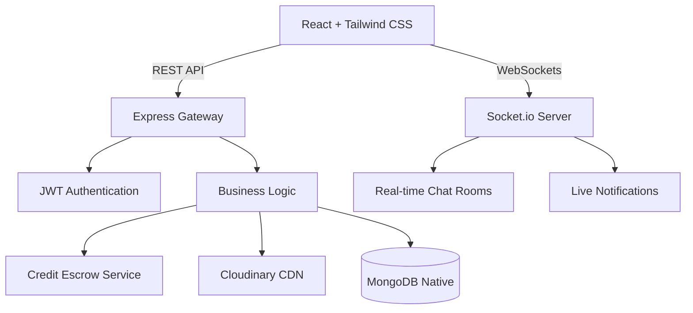

<div align="center">
  
  <h1>SkillSwap Campus</h1>
  <p>A Peer-to-Peer Skill Exchange & Tutoring Platform for University Students</p>

  <div>
    
    
    
    
    
  </div>
</div>

---

## 📖 Overview

SkillSwap Campus is a fully-featured, peer-to-peer learning marketplace designed specifically for university students. It empowers students to exchange knowledge by teaching what they know and learning what they need. Instead of relying on expensive external tutors, SkillSwap utilizes a closed **Credit Escrow Economy**—users earn credits by mentoring others and spend credits to book sessions.

This project was built to solve the "cold start" problem in campus learning by providing structured scheduling, real-time communication, dispute resolution, and community discussion boards.

## 🔥 Highlights

- Real-time chat and notifications using Socket.IO
- Credit escrow system with dispute resolution workflow
- Calendly-style mentor booking and availability management
- Community discussion forum with image uploads and reputation system
- MongoDB transaction-based credit transfers
- Secure authentication with JWT and OTP email verification
- Mentor discovery marketplace with advanced filtering and ranking
- Production-ready architecture with validation, security middleware, indexing, and pagination

## ✨ Key Features

### 🎓 For Learners
- **Mentor Discovery Hub**: Advanced filtering and sorting (by rating, reputation, and skill) to find the perfect peer mentor.
- **Calendly-style Booking**: Seamlessly view mentor availability and book time slots with timezone awareness.
- **Real-Time Session Chat**: Private socket-based chat rooms that unlock file sharing (PDFs, PPTs) once a session is scheduled.
- **Community Doubts Forum**: Post anonymous questions with markdown and image support.

### 👨‍🏫 For Mentors
- **Availability Management**: Set weekly recurring schedules and manage custom durations.
- **Credit Economy Wallet**: Earn credits securely through a 2-step escrow system (Credits are held during the session and released upon completion).
- **Reputation & Ranking**: A composite algorithm `(Rating*10 + Rep*5 + Sessions*2)` dynamically ranks top mentors.
- **Session Notes**: Provide post-session summaries and resources directly in the chat interface.

## 🏗️ Architecture

SkillSwap uses a modern MERN stack architecture with real-time event-driven components.



### Tech Stack
- **Frontend**: React 19, TailwindCSS, React Router, Socket.io-client
- **Backend**: Node.js, Express.js 5, Socket.io
- **Database**: MongoDB (Mongoose)
- **Infrastructure**: Cloudinary (Image/File Storage), Node-Cron (Background Jobs)
- **Authentication**: JWT, bcryptjs

## 📸 Screenshots

*(Replace these placeholder links with actual screenshots of your deployed application)*

| Mentor Marketplace | Session Chat & File Sharing |
| :---: | :---: |
|  |  |
| **Availability Calendar** | **Credit Escrow Dashboard** |
|  |  |

## 🚀 Live Demo

- **Frontend (Vercel)**: [https://skillswap-69qv.vercel.app](https://skillswap-69qv.vercel.app)
- **Backend API (Render)**: [https://skillswap-api-majl.onrender.com](https://skillswap-api-majl.onrender.com)

## 🛠️ Local Development & Deployment

### Prerequisites
- Node.js (v18 or higher)
- MongoDB Atlas cluster or local MongoDB
- Cloudinary Account (for file uploads)

### 1. Clone the repository
```bash
git clone https://github.com/KunalThakur00111/Skillswap.git
cd Skillswap
```

### 2. Environment Variables Setup

**Backend (`server/.env`)**:
```env
PORT=5000
NODE_ENV=development
CLIENT_URL=http://localhost:5173 # Use https://skillswap-69qv.vercel.app for production
MONGO_URI=your_mongodb_connection_string_here
JWT_SECRET=your_jwt_secret_here
ALLOWED_COLLEGE_DOMAINS=college.edu
EMAIL_HOST=smtp.gmail.com
EMAIL_PORT=587
EMAIL_USER=your_email@gmail.com
EMAIL_PASS=your_google_app_password
EMAIL_FROM=SkillSwap Campus <your_email@gmail.com>
CLOUDINARY_CLOUD_NAME=your_cloudinary_cloud_name
CLOUDINARY_API_KEY=your_cloudinary_api_key
CLOUDINARY_API_SECRET=your_cloudinary_api_secret
```

**Frontend (`client/.env`)**:
```env
VITE_API_BASE_URL=http://localhost:5000/api # Use https://skillswap-api-majl.onrender.com/api in production
VITE_API_URL=http://localhost:5000/api
VITE_SOCKET_URL=http://localhost:5000
```

### 3. Run Locally
**Backend**:
```bash
cd server
npm install
npm run dev
```

**Frontend**:
```bash
cd client
npm install
npm run dev
```

### 4. Production Deployment
1. **Database**: Create a MongoDB Atlas cluster and get the `MONGO_URI`.
2. **Cloudinary**: Get API credentials for image uploads.
3. **Backend (Render)**: Deploy the `server` directory and add all backend environment variables. Set `CLIENT_URL` to your Vercel URL.
4. **Frontend (Vercel)**: Deploy the `client` directory and set the `VITE_*` environment variables to point to your Render backend.
## 📈 Core Platform Modules

- Authentication & OTP Verification
- Mentor Discovery Marketplace
- Availability & Scheduling System
- Credit Escrow Economy
- Session Lifecycle Management
- Real-Time Chat & Notifications
- Community Doubts & Discussion Forum
- Reputation & Review System
- Admin Dispute Resolution
- File Upload & Resource Sharing

  
## 🛣️ Roadmap & Future Improvements

- [ ] Google Calendar Integration
- [ ] Mobile Application
- [ ] Mentor Verification System
- [ ] Advanced Analytics Dashboard
- [ ] Enhanced Automated Testing Coverage
- [ ] Community Moderation Tools

---

## 👨‍💻 Author

**Kunal Thakur**

Built with ❤️ using the MERN Stack.
